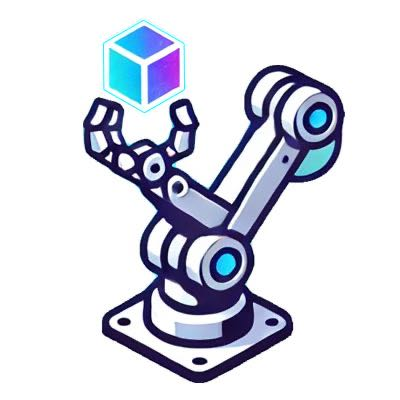
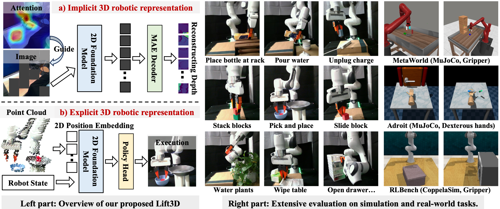

<div align="center">

#  Lift3D Foundation Policy: Lifting 2D Large-Scale Pretrained Models for Robust 3D Robotic Manipulation


  
[🌐**Project Page**](https://lift3d-web.github.io/) | [✍️**Paper(Arxiv)**](https://arxiv.org/abs/2411.18623) | [🎥**Demo**](https://lift3d-web.github.io/)

[Yueru Jia](https://github.com/jiayueru)\*, [Jiaming Liu](https://liujiaming1996.github.io/)\*, [Sixiang Chen](https://cscsx.github.io/)*, [Chenyang Gu](https://gaystarc.github.io/), [Zhilue Wang](https://lift3d-web.github.io/), [Longzan Luo](https://luolongzan.github.io/), [Lily Lee](https://lift3d-web.github.io/), 

[Pengwei Wang](https://lift3d-web.github.io/), [Renrui Zhang](https://lift3d-web.github.io/), [Zhongyuan Wang](https://lift3d-web.github.io/), [Shanghang Zhang](https://www.shanghangzhang.com)

</div>



**Lift3D** is a **3D robotic manipulation framework** 🤖, that enhances 2D foundation models to develop robust 3D manipulation policies by improving both implicit and explicit 3D robotic representations.

## ✨ News ✨
- [2024/12/09] The Lift3D code has been officially released! 🎉 Check it out now for detailed implementation and usage.

- [2024/11/27] Lift3D is now live on arXiv! 🚀 


## 📢 Repository Contents

- **Lift3D Model** 🎯:  Here, we provide the CLIP-vit-base model with MAE pretraining checkpoints.

- **Simulator Benchmark (2D&3D) 📈**: Code for data collection, training, and evaluation using simulators from **Metaworld and RLBench**. Metaworld are built for the latest version of the gynasim library. You can freely integrate various 2D and 3D encoders under this framework for testing.

- **2D and 3D Baseline Methods 🛠️**: Provides standard 2D and 3D baseline methods for comparison:

    - **2D Baseline**: [CLIP](https://github.com/openai/CLIP), [R3M](https://github.com/facebookresearch/r3m), [VC1](https://github.com/facebookresearch/eai-vc), [SPA](https://github.com/HaoyiZhu/SPA)
    - **3D Baseline**: [PointNet](https://github.com/yanx27/Pointnet_Pointnet2_pytorch), [PointNet++](https://github.com/yanx27/Pointnet_Pointnet2_pytorch), [PointNeXt](https://github.com/guochengqian/PointNeXt)
    

## 🤖 Demo
<div style="text-align:center;">
    
</div>

If you want to see more robot demonstration videos and method introductions, please visit our [project page](https://lift3d-web.github.io/). 🔗

## 📦 Installation

<details>
<summary>1. Clone the submodules</summary>

```bash
git submodule update --init --recursive
```

</details>

<details>
<summary>2. Create conda environment with python 3.11</summary>

```bash
conda create -n <env_name> python=3.11
conda activate <env_name>
```

</details>

<details>
<summary>3. Install PyTorch compatible with your CUDA and GPUs</summary>

```bash
# Modify this line according to your CUDA GPUs.
pip install torch==2.4.1 torchvision==0.19.1 torchaudio==2.4.1 --index-url https://download.pytorch.org/whl/cu124
```

</details>

<details>
<summary>4. Install pytorch3d. It takes a while (~10min in our environments)</summary>

```bash
pip install "git+https://github.com/facebookresearch/pytorch3d.git@stable"
```

</details>

<details>
<summary>5. Install dependencies of models</summary>

```bash
# R3M（A Universal Visual Representation for Robot Manipulation）
pip install git+https://github.com/facebookresearch/r3m.git --no-deps

# CLIP (Contrastive Language-Image Pre-Training)
pip install git+https://github.com/openai/CLIP.git --no-deps

# VC1（Visual Cortex）
cd third_party/eai-vc/vc_models
pip install -e .  --no-deps
cd ../../..

# SPA（3D SPatial-Awareness Enables Effective Embodied Representation）
cd third_party/SPA 
pip install -e . --no-deps
cd ../..
```

</details>

<details>
<summary>6. Set environment variables</summary>

```bash
# WandB
export WANDB_API_KEY=<wandb_api_key>
export WANDB_USER_EMAIL=<wandb_email>
export WANDB_USERNAME=<wandb_username>

# CoppeliaSim & PyRep & RLBench
export COPPELIASIM_ROOT=${HOME}/Programs/CoppeliaSim
export LD_LIBRARY_PATH=$COPPELIASIM_ROOT:$LD_LIBRARY_PATH
export QT_QPA_PLATFORM_PLUGIN_PATH=$COPPELIASIM_ROOT
export DISPLAY=:99  # required on server, remove it on workstation
```

</details>

<details>
<summary>7. Install dependencies of simulation environments</summary>

```bash
# Metaworld
pip install git+https://github.com/Farama-Foundation/Metaworld.git@master#egg=metaworld

# RLBench
wget https://downloads.coppeliarobotics.com/V4_1_0/CoppeliaSim_Edu_V4_1_0_Ubuntu20_04.tar.xz
mkdir -p $COPPELIASIM_ROOT && tar -xf CoppeliaSim_Edu_V4_1_0_Ubuntu20_04.tar.xz -C $COPPELIASIM_ROOT --strip-components 1
rm -rf CoppeliaSim_Edu_V4_1_0_Ubuntu20_04.tar.xz
cd third_party/RLBench
pip install -e .
cd ../..
```

</details>

<details>
<summary>8. Install the Lift3D package.</summary>

```bash
pip install -e .

# PointNext
cd lift3d/models/point_next
cd openpoints/cpp/pointnet2_batch
pip install -e .
cd ../subsampling
pip install -e .
cd ../pointops
pip install -e .
cd ../chamfer_dist
pip install -e .
cd ../emd
pip install -e .
cd ../../../../../..
```
</details>

## 🧩 Framework

- `config`: yaml files for hydra config

- `dataset`: datasets for each simulation environments

- `envs`: environments for each simulation platform

- `helpers`: functional modules

- `loss`: loss functions

- `models`: models including 2D/3D encoders and actors

- `scripts`: python files calling a script under `tools` with multiple groups of arguments

    -  **see detailed arguments in corresponding scripts**

- `tools`: executable python files that does one thing

    -  **see detailed arguments in corresponding scripts**

## 💡Usage

### Using Lift3D pretrained model.

- **Lift3d Model Checkpoints 📥** 
You can either manually download the model weights (ViT-B-32.pt and lift3d_clip_base.pth) from [Hugging Face](https://huggingface.co/jiayueru/Lift3d/blob/main/README.md) and place them in `lift3d/models/lift3d/ckpt`, or they will be automatically downloaded for you. In case of automatic download, the weights will be cached in the `lift3d/models/lift3d/ckpt`.

```python
# see also scripts/lift3d_example.py
import torch
from lift3d.models.lift3d.model_loader import lift3d_clip_base

device = torch.device("cuda" if torch.cuda.is_available() else "cpu")
model = lift3d_clip_base().to(device)
point_cloud = torch.randn([4, 1024, 3]).to(device)
output = model(point_cloud)

print(output.shape)
```

### Steps to train a policy on an existing environment.

To go through the whole process, there are 3️⃣ necessary steps:

**1. Get familiar with a certain simulation environment.**  
Sample some observations to know what's in the simulation environment.

```bash
# metaworld
python -m lift3d.tools.sample_obs_metaworld
python -m lift3d.tools.make_video_metaworld
python -m lift3d.scripts.sample_obs_metaworld
python -m lift3d.scripts.make_video_metaworld

# rlbench
python -m lift3d.tools.sample_obs_rlbench
python third_party/RLBench/tools/cinematic_recorder.py \
    --save_dir results/rlbench_cinematic \
    --tasks close_box
python -m lift3d.scripts.sample_obs_rlbench
python -m lift3d.scripts.gen_cinematic_rlbench
```

**2. Generate dataset.**  
- For Metaworld, datasets for training are directly generated in one script (under `tools`). 
- For RLBench, you should firstly generate source data and then convert source data to datasets for training.

```bash
# metaworld
python -m lift3d.tools.gen_data_metaworld
python -m lift3d.scripts.gen_data_metaworld

# rlbench
python -m rlbench.dataset_generator \
    --save_path ~/Data/RLBench_224 \
    --image_size 224 224 \
    --tasks close_box \
    --episodes_per_task 120
python -m lift3d.tools.gen_data_rlbench
python -m lift3d.scripts.gen_data_rlbench
```

**3. Train policy.**

Here's a simple example of how to run the script:  
For a full list of arguments, check out the `lif3d/config/train_xxx.yaml` file! 📄✨

```bash
python -m lift3d.tools.train_policy \
  --config-name=train_metaworld \
  agent=lift3d_bnmlp \
  task_name=assembly \
  camera_name=corner \
  dataloader.batch_size=16 \
  dataset_dir=data/metaworld/assembly_cornner.zarr
```
🔍 If you'd like to explore more detailed parameter options or run multiple models and tasks, check out the scripts we’ve provided! 

```bash
# see the example script 
python scripts/train_metaworld.py
python scripts/train_rlbench.py
```

## 📜️ License

This project is licensed under the MIT License - see the [LICENSE](LICENSE) file for details.

## 📚 BibTeX 

```bibtex
@misc{jia2024lift3dfoundationpolicylifting,
      title={Lift3D Foundation Policy: Lifting 2D Large-Scale Pretrained Models for Robust 3D Robotic Manipulation}, 
      author={Yueru Jia and Jiaming Liu and Sixiang Chen and Chenyang Gu and Zhilue Wang and Longzan Luo and Lily Lee and Pengwei Wang and Zhongyuan Wang and Renrui Zhang and Shanghang Zhang},
      year={2024},
      eprint={2411.18623},
      archivePrefix={arXiv},
      primaryClass={cs.CV},
      url={https://arxiv.org/abs/2411.18623}, 
}
```
